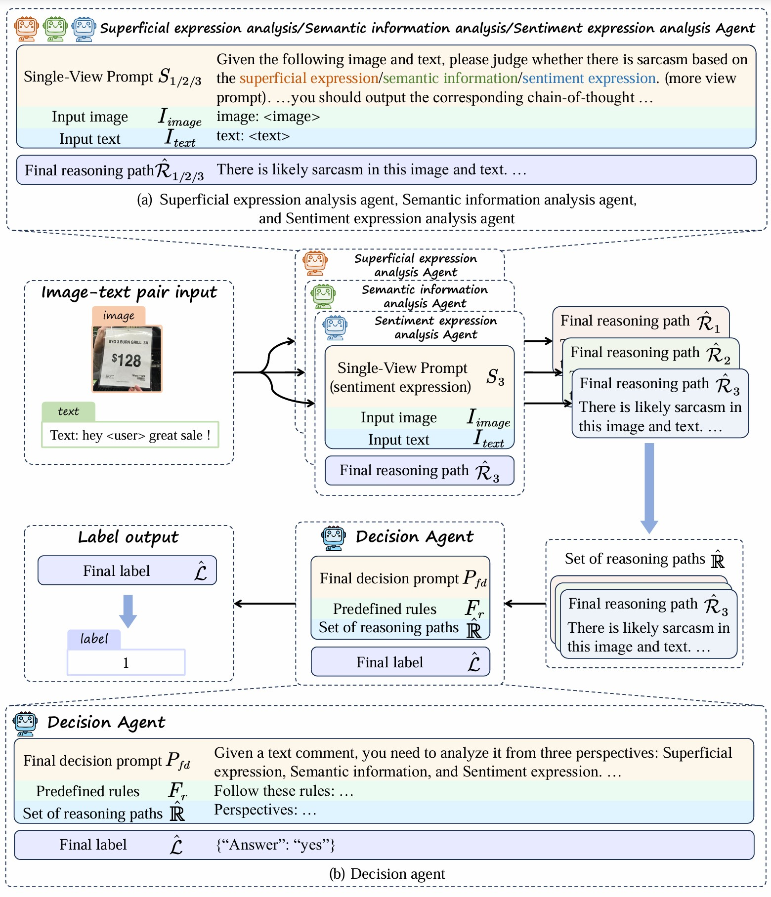
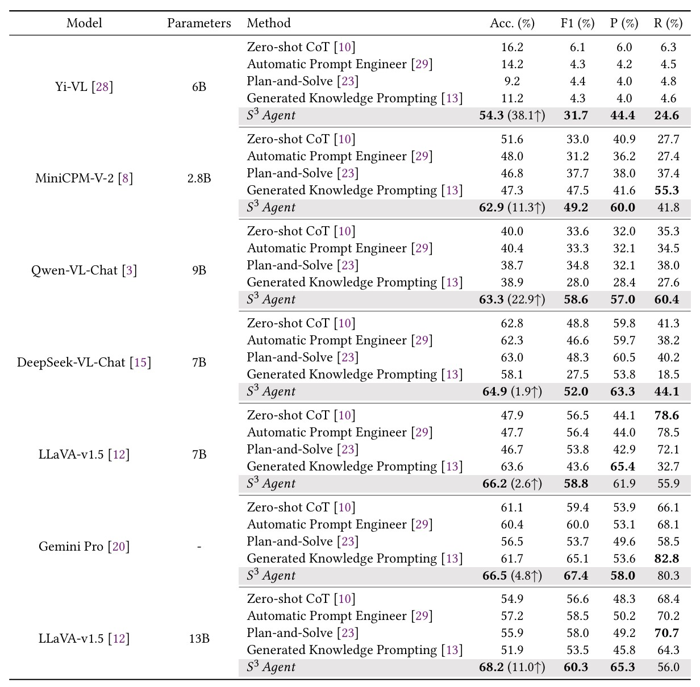

<h2 align="center">S<sup>3</sup> Agent: Unlocking the Power of VLLM for Zero-Shot Multi-modal Sarcasm Detection</h2>

### Table of Contents
- [News](#news)
- [Framework](#framework)
- [Dataset prepare](#dataset-prepare)
  - [Text data](#text-data)
  - [Image data](#image-data)
- [Environment prepare](#environment-prepare)
  - [Base environment](#base-environment)
  - [Model environment](#model-environment)
    - [Gemini Pro](#gemini-pro)
    - [Qwen-VL-Chat](#qwen-vl-chat)
    - [Yi-VL-6B](#yi-vl-6b)
    - [MiniCPM-V-2](#minicpm-v-2)
    - [LLaVA-v1.5-7B/13B](#llava-v15-7b13b)
    - [Deepseek-VL](#deepseek-vl)
- [Run our code](#run-our-code)
- [Performance](#performance)
- [Citation](#citation)
- [Contact](#contact)


## News
* 🎉🎉🎉We have our code ready and released!
* ✨✨✨After July 12, saved prompts using Gemini 1.0 Pro Vision in Google AI Studio will switch to using Gemini 1.5 Flash. API calls that specify Gemini 1.0 Pro Vision will fail. So if you want to test our code in Gemini, please modify `model = genai.GenerativeModel(name='gemini-pro-vision')` to `model = genai.GenerativeModel(name='gemini-1.5-flash')`.

## Framework

<div align="center">

</div>

## Dataset prepare

### Text data

MMSD dataset: `./text/text_json_clean`

MMSD 2.0 dataset:`./text/text_json_final`

### Image data

Download the image data from [1](https://drive.google.com/file/d/1mK0Nf-jv_h2bgHUCRM4_EsdTiiitZ_Uj/view?usp=sharing_eil&ts=5d480e04), [2](https://drive.google.com/file/d/1AOWzlOz5hmdO39dEmzhQ4z_nabgzi7Tu/view?usp=sharing_eil&ts=5d480e04), [3](https://drive.google.com/file/d/1dJERrVlp7DlNSXk-uvbbG6Rv7uvqTOKd/view?usp=sharing_eil&ts=5d480e04), [4](https://drive.google.com/file/d/1pODuKC4gP6-QDQonG8XTqI8w8ds68mE3/view?usp=sharing_eil&ts=5d480e04), and unzip them into folder `./image`

## Environment prepare

### Base environment
You need to install these packages first:
```
pip install tqdm pillow scikit-learn
```

### Model environment
Since various models require specific environments, you should install the necessary dependencies accordingly after installing the base environment.

#### Gemini Pro
```
pip install google-generativeai
```
Then you need to fill in the API key from [Google AI Studio](https://aistudio.google.com/) in `gemini_pro.py -> genai.configure(api_key='your api key')`.

#### Qwen-VL-Chat
```
cd env
pip install -r qwen_vl_requirements.txt
```

#### Yi-VL-6B
```
cd env
pip install -r yi_vl_requirements.txt
```

#### MiniCPM-V-2
```
cd env
pip install -r minicpm_requirements.txt
```

#### LLaVA-v1.5-7B/13B
1. Clone this repository and navigate to LLaVA folder
```
git clone https://github.com/haotian-liu/LLaVA.git
cd LLaVA-main
```
2. Install Package
```
conda create -n llava python=3.10 -y
conda activate llava
pip install --upgrade pip  # enable PEP 660 support
pip install -e .
cd ..
```

#### Deepseek-VL
On the basis of `Python >= 3.8` environment, install the necessary dependencies by running the following command:
```
git clone https://github.com/deepseek-ai/DeepSeek-VL
cd DeepSeek-VL

pip install -e .
cd ..
```

## Run our code
You only need to run the following command in the terminal:
```
python main.py --dataset dataset_name --model model_name --eval test

# dataset = ['mmsd', 'mmsd2']
# model = ['gemini_pro', 'qwen_vl', 'yi_vl', 'minicpm_v2', 'llava_v1_5', 'deepseek_vl_chat']
# eval = ['test', 'valid']
```

For Yi-VL, you need to add this line of command before running the command:
```
CUDA_VISIBLE_DEVICES=0 python main.py --...
```

## Performance

<div align="center">

</div>

## Citation
```bibtex
@article{wang2024s3,
  title={S3 Agent: Unlocking the Power of VLLM for Zero-Shot Multi-modal Sarcasm Detection},
  author={Wang, Peng and Zhang, Yongheng and Fei, Hao and Chen, Qiguang and Wang, Yukai and Si, Jiasheng and Lu, Wenpeng and Li, Min and Qin, Libo},
  journal={ACM Transactions on Multimedia Computing, Communications and Applications},
  year={2024},
  publisher={ACM New York, NY}
}
```

## Contact

Please create Github issues here or email [Peng Wang](mailto:wpengxss@gmail.com), [Yongheng Zhang](mailto:zyhbrz@gmail.com), and [Libo Qin](mailto:lbqin@csu.edu.cn) if you have any questions or suggestions. 